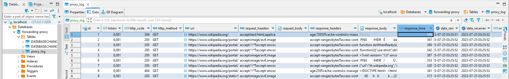

# forwarding-proxy-with-dblog

This project is forwarding proxy with database logs on Http 1.1. Not support Http 2.0. This application have been developed based on Java 8 with Spring Boot. You need to installed Maven and JDK 8 for building and running.

## Build
01_build_application.bat

## Test (Unit test)
02_test_application.bat

## Run code analysis for code coverage (SonarQue) 
03_run_code_coverage.bat
Note!!! Don't forget to start docker for SonarQue. Please see docker files in docker folder.

## Start Spring Boot Application by jar file
04_run_backendservice.bat

